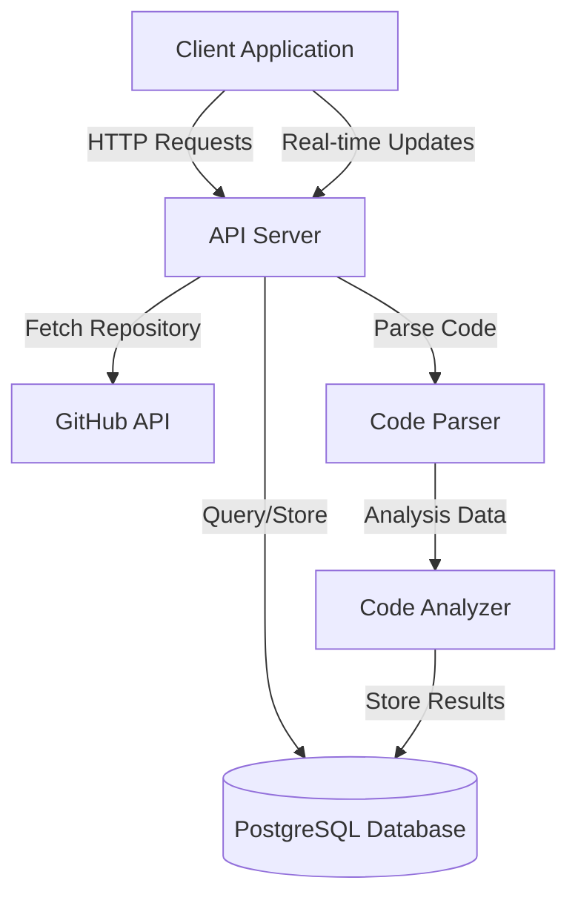
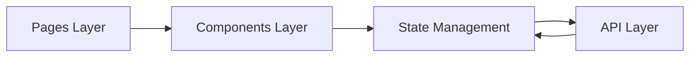
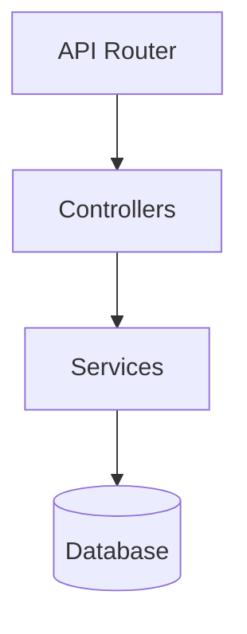
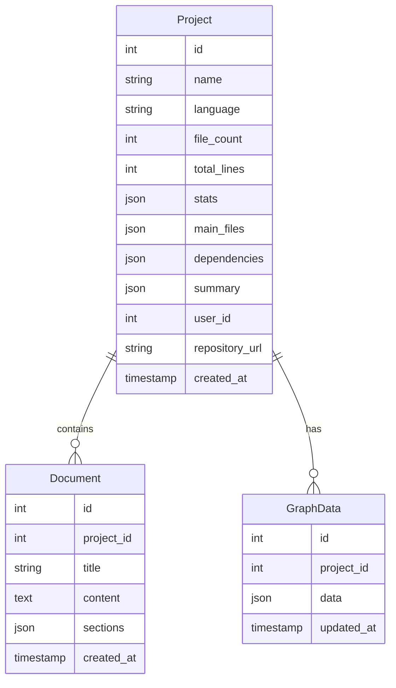
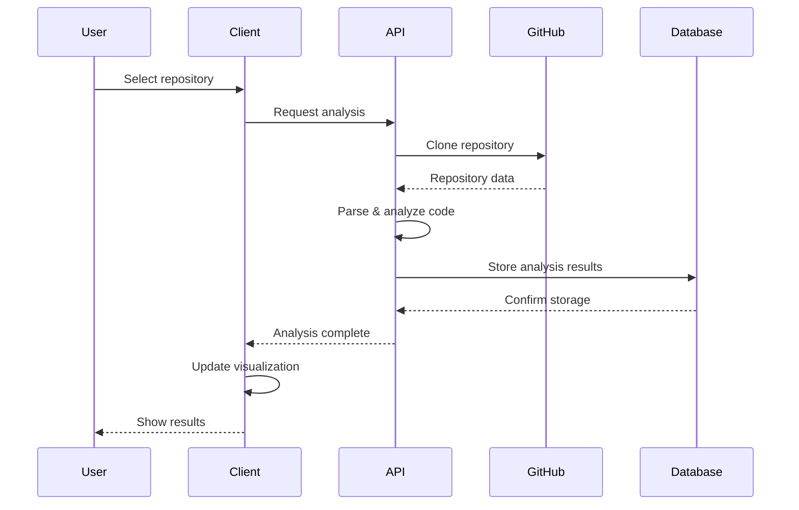

# System Design Documentation

## 1. System Overview

## 2. Core Components

### 2.1 Frontend Architecture

#### Key Components:
- **Pages**
  - Project Analysis
  - Relationship Visualization
  - Documentation View
  - Settings

- **Shared Components**
  - DependencyGraph
  - AnalysisTabs
  - LanguageBadge
  - UI Components

- **State Management**
  - React Query for API state
  - React Context for app state
  - Local state for component-specific data

### 2.2 Backend Architecture

#### Key Services:
- **Project Analysis Service**
  - Repository cloning
  - Code parsing
  - Dependency analysis
  - Documentation generation

- **Graph Service**
  - Dependency relationship mapping
  - Graph data generation
  - Optimization algorithms

- **Storage Service**
  - Database operations
  - File system management
  - Caching layer

## 3. Data Models

### 3.1 Database Schema

## 4. Key Features

### 4.1 Code Analysis
- Repository scanning
- Dependency detection
- Code quality assessment
- Documentation generation

### 4.2 Visualization Types
1. **Force Directed Graph**
   - Interactive node dragging
   - Physics-based layout
   - Dynamic node sizing
   - Color-coded groups

2. **Tree View**
   - Hierarchical layout
   - Parent-child relationships
   - Collapsible nodes
   - Horizontal orientation

3. **Circular Layout**
   - Radial arrangement
   - Connection visualization
   - Group clustering
   - Equal node spacing

### 4.3 Analysis Features
- File relationship mapping
- Dependency tracking
- Code complexity analysis
- Issue detection
- Documentation generation

## 5. Technical Stack

### 5.1 Frontend
- React.js with TypeScript
- D3.js for visualizations
- TailwindCSS for styling
- React Query for data fetching
- Shadcn UI components

### 5.2 Backend
- Node.js/Express
- PostgreSQL database
- TypeScript
- GitHub API integration

## 6. Data Flow

## 7. Security Considerations

### 7.1 Authentication
- JWT-based authentication
- Secure token storage
- Role-based access control

### 7.2 Data Protection
- Encrypted database connections
- Secure API endpoints
- Rate limiting
- Input validation

## 8. Performance Optimization

### 8.1 Frontend
- Lazy loading of components
- Virtualization for large datasets
- Efficient D3.js rendering
- Caching strategies

### 8.2 Backend
- Query optimization
- Caching layer
- Batch processing
- Asynchronous operations

## 9. Scalability

### 9.1 Horizontal Scaling
- Stateless API design
- Load balancing
- Database replication
- Caching strategies

### 9.2 Vertical Scaling
- Resource optimization
- Performance monitoring
- Database indexing
- Query optimization

## 10. Future Enhancements

### 10.1 Planned Features
- Real-time collaboration
- Advanced code metrics
- Custom visualization types
- Integration with more VCS platforms
- AI-powered code analysis
- Automated documentation generation

### 10.2 Technical Improvements
- GraphQL API implementation
- WebSocket integration
- Microservices architecture
- Enhanced caching strategies
- Automated testing improvements 